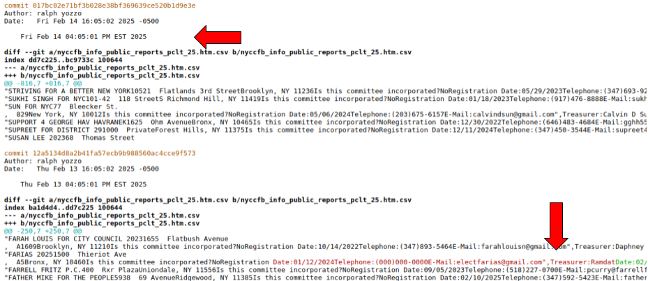

# campaign-tracker

GitHub provides a visual interface for viewing the history of changes, comparing different versions of files, and reviewing code changes before they are merged into the main branch. This makes it easy to collaborate on projects, track progress, and maintain a clean and organized codebase.

We are monitoring certain web pages and committing all the changes here.  

See a live updated [report here](https://html-preview.github.io/?url=https://github.com/fedex1/campaign-tracker/blob/main/changes.2025.html).

https://html-preview.github.io/?url=https://github.com/fedex1/campaign-tracker/blob/main/changes.2025.html

